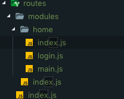

# 架构说明


## src目录说明
### assets：静态文件目录  
### components：公用组件目录  
公用组件放在这个目录下。系统会自动将目录下的index.vue文件注册成全局组件，组件名称由index.vue的name属性决定。  
建议在该目录下放文件夹作为一个组件，文件夹内放入index.vue。  
  
**示例：**


```
<template>
  <div></div>
</template>
<script>
export default {
  name: 'Map', // 组件名称
  components: {},
  props: {},
  data() {
    return {}
  },
  computed: {},
  created() {},
  mounted() {},
  methods: {}
}
</script>
<style scoped lang="less"></style>
```


如果要取消注册该组件但又不想删除文件，则将组件文件夹名称后加上.false即可


### request：axios二次封装
为vue实例增加了$axios全局对象，以及暴露get和post方法，返回promise对象。  
**示例：**  
```
this.$axios.get(url,params)
```  
或  

```
import {get,post} from '@/request'

get(url,params)
post(url,params)
```
### routes：路由文件夹
添加新的路由，在modules里增加文件夹，路径最好同路由路径相同。  
新增的文件夹里需要有一个index.js作为本路由的主文件。并且获取本目录下的所有其他文件作为其子路由。
目前只支持modules下一级目录，要增加更深的路径，可自行在子路由中增加。  
   
index写法


routes/modules/home/index


```
import { FileUtils } from '../../../utils/tools'
const files = require.context('.', false, /\.js$/)
const configRouters = FileUtils.getLocalRouterFiles(files)

export default {
  path: 'home',
  name: 'home',
  hidden: false,
  redirect: 'home/main',
  meta: {
    title: ''
  },
  component: () => import(/* webpackChunkName: "home_base" */ '@/views/home/_base'),
  children: [...configRouters]
}
```


子路由写法  
routes/modules/home/login


```
export default [
  {
    path: 'login',
    name: 'login',
    hidden: false,
    meta: {
      title: '登录'
    },
    component: () => import(/* webpackChunkName: "home_login" */ '@/views/home/login')
  }
]
```
### services：接口调用文件夹
文件目录：  
  
其中_serviceBaseClass.js文件是所有接口调用文件的父类。提供三个方法：


```
import api from '../request'
export class ServiceBaseClass {
  static url = ''
  static params = ''
  static setParams(url, params) {
    this.url = url || ''
    this.params = params || {}
  }
  static get() {
    return api.get(this.url, this.params || {})
  }
  static post() {
    return api.post(this.url, this.params || {})
  }
}

```

`setParams`方法为设置请求的url和参数


`get`方法提供get请求方法


`post`方法提供post请求方法

目录下其他文件则是具体的接口调用类。


```
import { ServiceBaseClass } from './_serviceBaseClass'
export default class DictService extends ServiceBaseClass {
  url = ''
  params = {}
  // 获取所有字典信息
  static getList() {
    this.setParams('/dict/get', {})
    return super.get()
  }
  // 获取某个字典信息
  static getOne(id) {
    this.setParams('/dict/getOne', { id })
    return super.get()
  }
}
```


setParams之后，直接调用父类的get、post方法即可

### utils：工具文件夹
提供各种公用方法。方法注意提供注释，说明入参及返回值。

### views：页面文件夹
页面文件放这里，路径最好和路由路径一样，方便查找。

## 说明
部分功能没在实际项目使用中测试过，尤其是路由目录路径的安排，出现不好用的情况就按照基本习惯改写即可。

出现奇怪的问题请联系我。

qq:382517251


